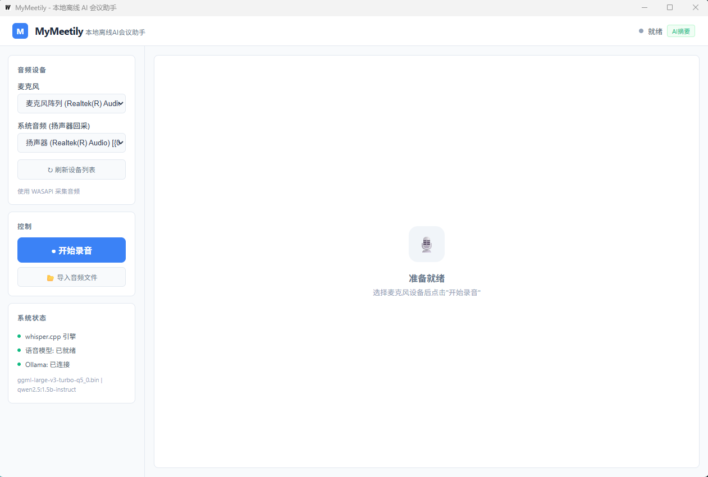

# MyMeetily — 本地离线 AI 会议助手

> 录音 → 实时字幕 → 语音转文字 → 自动生成会议纪要，全程离线，无需联网。

<p align="center">
  <strong>🖥️ Windows 桌面应用 · Go + React + 🎙️ whisper.cpp + 🦙 Ollama · 🔒 纯本地运行</strong>
</p>

---

## 与 Meetily 的区别

[Meetily](https://github.com/Zackriya-Solutions/meetily) 是这个领域最知名的开源项目（11k+ Stars），MyMeetily 借鉴了它的理念，但走了不同的技术路线：

| | Meetily | MyMeetily |
|---|---|---|
| 技术栈 | Tauri (Rust) + Next.js (Web 前端) | **Go + React + TypeScript** (Wails v2) |
| 运行环境 | 需 WebView / 浏览器 | **原生 Windows 桌面应用** |
| 安装包体积 | ~150MB+ | **~22MB** (不含模型) |
| 内存占用 | 中等 (Chromium 内核) | **低** (系统 WebView2 复用) |
| 跨平台 | macOS / Windows / Linux | Windows（Wails 跨平台编译可行） |
| LLM 后端 | Ollama / Claude / Groq / 多选 | **Ollama**（简单够用） |
| GPU 加速 | Metal / CUDA / Vulkan | **CUDA** |
| 中文体验 | 通用多语言 | **中文优先**（qwen 模型 + zh 调优） |
| 实时字幕 | 支持 | 支持（能量 VAD + whisper 逐句） |
| 付费模式 | 社区版免费 + Pro $10/月 | **完全免费**，无 Pro 版 |
| 设计理念 | 功能全面，企业级 | **极致轻量**，开箱即用 |

**一句话：Meetily 是大而全的瑞士军刀，MyMeetily 是开箱即用的快刀。**

---

## 为什么选择 MyMeetily？

|          | MyMeetily                | 在线会议工具 | 其他转写软件 |
| -------- | ------------------------ | ------------ | ------------ |
| 隐私     | ✅ 所有数据留在本机       | ❌ 音频上传云端 | ⚠️ 取决于厂商 |
| 费用     | ✅ 完全免费               | ❌ 付费订阅   | ⚠️ 按小时收费 |
| 网络     | ✅ 离线可用               | ❌ 需要联网   | ⚠️ 部分离线   |
| 中文优化 | ✅ whisper + qwen 专优    | ⚠️ 通用模型   | ⚠️ 参差不齐   |
| 可控性   | ✅ 开源可定制             | ❌ 封闭       | ❌ 封闭       |

---

## 界面预览



### 单页仪表盘布局

- **左侧栏** — 麦克风/扬声器设备选择、录音控制、系统状态
- **中央区域** — 按状态切换：待机画面 → 实时录音字幕 → 处理进度 → 会议纪要结果
- **顶部栏** — 应用标题、当前状态指示器、AI 摘要开关

---

## 核心功能

### 🎙️ 一键录音

- 自动检测麦克风和系统音频设备（WASAPI）
- 同时录制**你的声音 + 对方的声音**（系统音频回环）
- 录音文件自动存入时间戳文件夹，管理清晰

### 📝 实时字幕

- 录音时实时显示转写字幕，延迟仅 1-3 秒
- 基于能量检测（VAD）自动切句
- 音量条随声音大小跳动

### 🤖 AI 自动整理

- 录音结束自动触发处理流水线：
  ```
  音频预处理 → whisper.cpp 语音识别 → Ollama LLM 整理 → 生成会议纪要
  ```
- 4 阶段进度可视化，每步清晰可见

### 📂 导入音频文件

- 支持导入已有音频文件（mp3/wav/m4a/flac/ogg/wma/aac）
- 直接进入处理管线生成会议纪要

### 📄 会议纪要输出

每次录音生成 4 个文件，放在同一个文件夹：

```
output/20260601_143052/
├── live_20260601_143052.wav      ← 原始录音
├── live_20260601_143052_转写.txt  ← 逐字转写
├── live_20260601_143052_纪要.html ← 精美 HTML 会议纪要
└── live_20260601_143052_纪要.md   ← Markdown 版本
```

---

## 技术架构

```
┌──────────────────────────────────────────────────┐
│                   MyMeetily                       │
├─────────────────────┬────────────────────────────┤
│  React + TypeScript │  ⚡ Wails IPC Bridge (Bind) │
│  灰白简约 UI         ├────────────────────────────┤
│  (Vite 构建)         │  WASAPI 音频  │ whisper.cpp│
│                     │  (go-wca)    │  语音识别   │
│                     │  Ollama LLM  │  Eino Agent │
│                     │  文本整理     │  Graph 管线 │
├─────────────────────┴────────────────────────────┤
│  前端 (WebView2)     │   后端 (Go)               │
└──────────────────────────────────────────────────┘
```

| 模块     | 技术选型              | 说明                            |
| -------- | --------------------- | ------------------------------- |
| 桌面框架 | Wails v2              | Go + WebView2，替代 Electron    |
| 前端     | React + TypeScript    | 单页仪表盘，灰白简约风格         |
| 音频采集 | WASAPI (go-wca)       | Windows 原生 API，零外部依赖    |
| 语音识别 | whisper.cpp (CUDA)    | large-v3-turbo q5_0，~548MB     |
| 文本整理 | Ollama HTTP API       | qwen2.5:1.5b-instruct（可替换） |
| 流水线   | CloudWeGo Eino        | 字节跳动 Go Agent 框架          |
| 实时字幕 | 能量 VAD + whisper    | 逐句切割，异步转写              |

---

## 快速开始

### 前置条件

- Windows 10/11
- [Ollama](https://ollama.com/download/windows)（需自行安装并启动）
- [Go](https://go.dev/dl/) 1.21+
- [Node.js](https://nodejs.org/) 18+（仅开发构建需要）
- NVIDIA 显卡（可选，CPU 也可运行但较慢）

### 安装步骤

```bash
# 1. 克隆项目
git clone https://github.com/<your-username>/mymeetily.git
cd mymeetily

# 2. 下载依赖
go mod download

# 3. 下载 whisper.cpp 引擎（CUDA 版本）
go run . init-engine

# 4. 下载模型文件（whisper + Ollama）
go run . init-model

# 5. 构建并运行
wails build
./build/bin/mymeetily.exe
```

### 开发模式

```bash
# 启动开发服务器（前端热重载）
wails dev
```

---

## 适用场景

- 远程会议：同时录制你和对方的声音，自动生成纪要
- 面试记录：实时字幕辅助，事后可回溯原文
- 课堂笔记：录下讲课内容，一键转文字
- 头脑风暴：自由讨论不中断，事后 AI 提炼要点
- 个人备忘：口述想法，AI 整理成结构化笔记

---

## 配置

编辑 `configs/config.yaml`：

```yaml
asr:
  whisper_binary: "llmengine/whispercpp/Release/whisper-cli"
  model_path: "./llmmodels/whisper/ggml-large-v3-turbo-q5_0.bin"
  language: "zh"

ollama:
  endpoint: "http://127.0.0.1:11434"
  model: "qwen2.5:1.5b-instruct"       # 可换更大模型
  temperature: 0.3
  max_tokens: 4096

audio:
  backend: "wasapi"
  sample_rate: 16000
  channels: 1

output:
  output_dir: "./output"
```

---

## 开发

```bash
wails dev                       # 开发模式（前端热重载）
wails build                     # 生产构建
go run . init-engine            # CLI: 安装引擎
go run . init-model             # CLI: 下载模型
go test ./internal/... -v       # 测试
go vet ./...                    # 代码检查
```

---

## 开源协议

MIT License

---

<p align="center">
  <sub>你的会议数据，只属于你。</sub>
</p>
